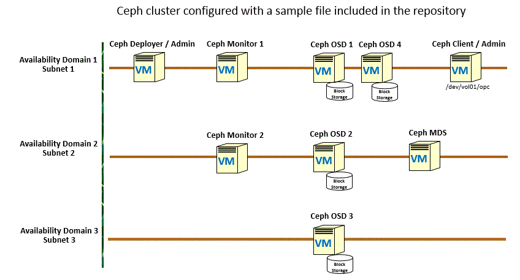

[terraform]: https://terraform.io
[OCI]: https://cloud.oracle.com/cloud-infrastructure
[oci provider]: https://github.com/oracle/terraform-provider-oci/releases
[SSH key pair]: https://docs.us-phoenix-1.oraclecloud.com/Content/GSG/Tasks/creatingkeys.htm
[API signing]: https://docs.us-phoenix-1.oraclecloud.com/Content/API/Concepts/apisigningkey.htm
[yum terraform]: http://public-yum.oracle.com/repo/OracleLinux/OL7/developer/x86_64/getPackage/terraform-0.11.3-1.el7.x86_64.rpm
[yum oci provider]: http://public-yum.oracle.com/repo/OracleLinux/OL7/developer/x86_64/getPackage/terraform-provider-oci-2.0.7-1.el7.x86_64.rpm

# Ceph Installer for Oracle Cloud Infrastructure
# Version: 1.0

## About

The Ceph Installer for Oracle Cloud Infrastructure provides a Terraform-based Ceph Cluster installation for Oracle
Cloud Infrastructure. It consists of a set of [Terraform][terraform] scripts and modules and three example configurations that can
be used to provision and configure the resources needed to run a Ceph Storage Cluster on [Oracle Cloud Infrastructure][OCI] (OCI).
The infrastructure resources include:
- Virtual Cloud Network (VCN) (optional)
- Subnet (optional)
- Compute instances for the Ceph Admin, Monitor, and Object Storage Devices (OSDs)
- Block Storage for the Compute Nodes (optional)

## Cluster Configuration Overview

The exact configuration of the cluster is controlled by the variables defined in a Terraform script (such as variables.tf).
There are three example files, variables.ex[1,2,3], which can be renamed variables.tf to create different configurations.
By changing the values of those variables, one can decide:
- whether to create a new VCN or use an existing one
- whether to create subnet(s) or use existing one(s)
- the number and shapes of compute nodes for the Admin, Monitor, and OSD nodes
- whether to create Block Storage volumes for the OSDs
- the placement of the subnets and the compute nodes on the Availability Domains


### Example 1

The configuration provided in this example will provision:
- a VCN with a Classless Inter-Domain Routing (CIDR) block of 10.0.0.0/16
- three subnets with CIDR blocks of 10.0.1.0/24, 10.0.2.0/24, and 10.0.3.0/24 on availability domains 1, 2, and 3
- a Compute instance with a shape of "VM.Standard1.1" for Ceph Admin / Deployer
- a Compute instance with a shape of "VM.Standard1.2" for Ceph Monitors
- a Compute instance with a shape of "VM.Standard1.1" for Ceph OSDs
- a Compute instance with a shape of "VM.Standard1.2" as Ceph Client (for testing purposes)
- Block Storages for each of the OSDs

It will then install the required Ceph components on various nodes and configure them. The client node will have a file system created over the Ceph block devices and mounted on /var/vol101. The 'opc' directory under /var/vol101 will have the read and write permissions for the user 'opc'.



### Example 2

Similar to Example 1 but creates only 2 OSDs with replication level set to 2. It also uses compute nodes of shape "VM.DenseIO1.4" with NVMe, and therefore, doesn't create any block storage. It also doesn't create any clients.

### Example 3

Similar to Example 1 but creates only 3 OSDs with replication level set to 3. It also uses compute nodes of shape "BM.HighIO1.36" with NVMe, and therefore, doesn't create any block storage.


## Prerequisites

1. Download and install [Terraform RPM][yum terraform] or [Terraform][terraform] (v0.11.0 or later)
2. Download and install the [OCI Terraform Provider RPM][yum oci provider] or [OCI Terraform Provider][oci provider] (v2.0.4 or later)
3. Create a Terraform configuration file at  `~/.terraformrc` that specifies the path to the OCI provider:
```
providers {
  oci = "<path_to_provider_binary>/terraform-provider-oci"
}
```
4. Export the environment related variables. Go to the project root directory, make a copy of the env-vars.sample, add the appropriate values that
specifies your [API signature](API signing), tenancy, user, and compartment within OCI, and source it:
```bash
$ cd terraform-modules/ceph-cluster
$ cp env-vars.sample env-vars
# Edit the env-vars file.
$ . env-vars
```

5. Start from one of the included examples (e.g., variables.ex1)
```bash
$ cp variables.ex1 variables.tf
```

## Quick start

```bash
# Initialize your Terraform configuration including the modules
$ terraform init

# Optionally customize the deployment by overriding input variable defaults in `variables.tf` as you see fit
# Edit variables.tf

# See what Terraform will do before actually doing it
$ terraform plan

# Provision resources and configure the Ceph cluster on OCI
$ terraform apply
```

The Ceph cluster will be running after the configuration is applied successfully and the cluster installation
scripts have been given time to finish asynchronously. Typically this takes around 13 minutes after `terraform apply`
and will vary depending on the instance counts and shapes.

It will print out the IP addresses for all the compute nodes. The IP addresses will be required to access the nodes. If at any point you need to list the IP addresses again just type:
```bash
$ terraform show
```

#### Access one of the Ceph Monitors and view the status of Ceph Cluster

```bash
$ ssh -l opc <monitor-ip-address>
$ ceph status
```

#### Access the Ceph Client and check for the filesystem
```bash
$ ssh -l opc <client-ip-address>
$ df -h
```

## Known issues and limitations
* Terraform doesn't check for any inconsistencies among various input variables. For example, it will fail if the specified subnet id for a compute node doesn't belong to the specified availability domain for the same node. It is your responsibility to make sure the inputs are consistent with one another.
* Use all lowercase for names of resources. Names with uppercase letters on network resources may cause problems.
